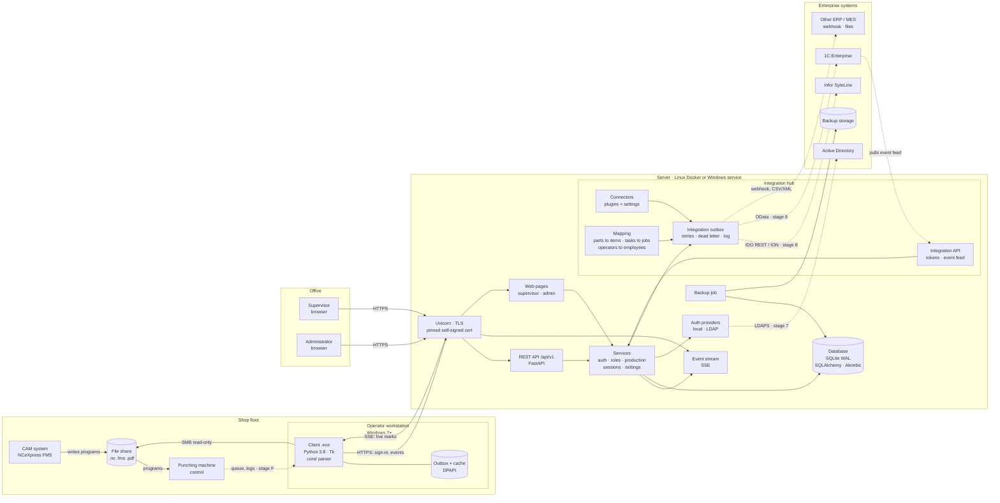
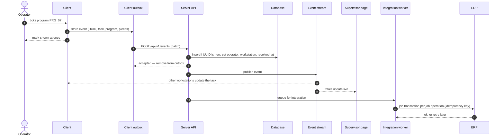

# Nestrack architecture

**English** · [Русский](ARCHITECTURE.ru.md)

Nestrack grew out of [finnpower-counter](https://github.com/malinkin-s/finnpower-counter), a standalone utility
built for one job on one machine: show the operator of a Prima Power /
Finn-Power punching machine (NCeXpress FMS postprocessor) which positions of
a shift task are complete. Nestrack takes the same idea further — role-based
sign-in, a production log, saved sessions, a live view for the shift
supervisor, directory and ERP integration. All of that is built around a
**server**, with a **client** at the operator's workstation.

finnpower-counter stays a separate, standalone project. Nestrack reuses its
file parsing as a dependency.

This document records the decisions and the reasons behind them. The order
of work is in [ROADMAP.md](ROADMAP.md), the task breakdown in
[TASKS.md](TASKS.md).

Status: **planned, not implemented.**

---

## Overview

```
 Shop-floor PC (Windows 7)                Server (Linux / Docker, or Windows)
┌─────────────────────────────┐         ┌───────────────────────────────────┐
│ Operator client (.exe)      │  HTTPS  │ API                               │
│  core/ — .nc/.fms parsing   │ ──────► │  sign-in, roles, production, sess.│
│  marks, PIN sign-in         │ ◄────── │ Event stream (SSE)                │
│  outbox                     │   SSE   │ Database                          │
│  local cache (DPAPI)        │         │ Supervisor and admin web pages    │
└─────────────────────────────┘         └───────────────────────────────────┘
                                                        ▲
                                  Supervisor's and ─────┘  HTTPS
                                  admin's browser
```

| Who | Uses | Does |
|---|---|---|
| Operator | Client on the shop-floor PC | Opens a shift task, marks programs, saves sessions |
| Supervisor | Server web page in a browser | Watches production live, exports CSV |
| Administrator | Server web page | Users, workstations, backups |

Test benches for all of this: [TEST_BENCH.md](TEST_BENCH.md).

Only the operator runs the client: they need the folder with `.nc` files on
the shop-floor PC, and a browser cannot read it. The supervisor and the
administrator install nothing.

### Target system

How the whole system is meant to work once all stages are done: abstract
nodes, the concrete technology on each, and the links between them.
Dashed links are optional or later stages.



### One mark, end to end



If the server is unreachable, steps 4–11 wait in the client outbox; if the
ERP is unreachable, steps 12–13 wait in the integration outbox. Neither
stops the operator.

---

## Why a server rather than a shared network folder

The first draft of this plan kept the data on a shared network drive with
no server: a log of encrypted files, keys in a file, folder polling. It
would work, but nearly all of its complexity comes from having no central
node:

| Concern | Shared folder | Server |
|---|---|---|
| Concurrent writes from several PCs | A log of files — SQLite on a network drive gets corrupted | A real database with transactions |
| Seeing other clients' changes | Poll the folder every few seconds | The server pushes events immediately |
| Encryption | Hand-rolled on Windows CNG via ctypes — the main Win7 risk | TLS from the standard library |
| Brute-forcing a PIN from a copied key file | Mitigated by a workstation secret | Nothing to brute-force: the server checks the PIN and limits attempts |
| Role permissions | Enforced by the client only | Enforced by the server |
| Recording production under someone else's name | Not prevented | The server sets the author from the sign-in session |
| Clock drift between PCs | Event IDs; timestamps unreliable | The server sets the time |

The cost: a machine for the server and someone to look after it, two
programs instead of one, and a contract between them (the API). For a shop
with several workstations and a supervisor who wants live data it is worth
it.

The shared folder stays as a **fallback** if a server turns out to be
impossible: the client's storage layer sits behind an interface, and the
second option can be plugged in without touching the window or the core.

---

## What stays the same

- **Client: Windows 7 32-bit, Python 3.8.10, a single `.exe`, no external
  dependencies.** HTTPS and JSON are in the standard library (`http.client`,
  `ssl`, `json`).
- **Program files are read-only.** The client never writes to `.nc`, `.fms`
  or setup sheets and never talks to the machine control.
- **File parsing comes from finnpower-counter.** Its `core/` (and the
  stdlib-only `presentation` helpers) is installed as a pinned, tagged
  package and bundled into the client `.exe` by PyInstaller. Parser
  improvements are made there and reach both projects.
- **Standalone use stays with finnpower-counter.** A shop that needs no
  server keeps using it; the Nestrack client always works with a server and
  survives outages with its offline mode.

## What is different from finnpower-counter

- **The client needs the network.** finnpower-counter's build excludes `ssl`,
  `http`, `socket`, `email` and `urllib` on purpose; the Nestrack client
  includes them.
- **History is kept** — on the server, not on the shop-floor PC.
  finnpower-counter keeps none.
- Program files are still never modified and the machine is not touched.

---

## Server

### Platform

The server is not bound by the shop-floor constraints: modern Python,
ordinary dependencies.

- **Primary platform: Linux in Docker.** One command brings the server up
  on a test VM and on the shop floor. The reference deployment is
  `docker compose`.
- **Windows is supported too.** The code uses nothing Linux-only, and CI
  runs the server tests on Windows as well. Running as a Windows service is
  documented when it is needed.

### Technology

| What | Choice | Why |
|---|---|---|
| Web framework | FastAPI + Uvicorn | Async, generates the API description |
| Database | SQLite in WAL mode on the server's local disk | Tens of events per shift; plenty of headroom, backup is a file copy |
| Data access | SQLAlchemy Core + Alembic | Schema migrations; moving to PostgreSQL is a connection-string change |
| Password and PIN hashes | `hashlib.scrypt` | Standard library, slow by design |
| Web pages | Jinja2 templates + a little JavaScript | No heavy front end: tables, filters, CSV |
| Live updates | Server-Sent Events | Plain HTTP: `EventSource` in the browser, `http.client` in the client |

**Why SSE, not WebSocket.** The stream goes one way — from the server to the
clients; the client sends marks as ordinary requests. SSE is an ordinary HTTP
response that never ends: both a browser and a Python 3.8 client can read it
without third-party libraries. WebSocket is not in the standard library.

**Caching.** A separate server-side cache (Redis and the like) is not needed:
the volumes are small and the database answers faster than the network to
the shop floor. Caching belongs on the client, for working offline (below).

### Data

| Table | Holds |
|---|---|
| `users` | Name, role, PIN or password hash, blocked flag |
| `workstations` | Registered shop-floor PCs and their keys |
| `auth_sessions` | Sign-in sessions: who, from which workstation, until when |
| `tasks` | Shift tasks: content-based ID, program names |
| `events` | Production log: marks and unmarks |
| `bookmarks` | Users' saved sessions |
| `settings` | Administrator settings: shifts, time format, retention, visibility |
| `audit` | Sign-ins, failed attempts, administrator actions |
| `connections`, `mappings`, `integration_outbox`, `api_tokens` | Integration hub (stage 8) |

Where the database and backups live is set by the administrator in the
server configuration (a Docker volume or a folder on the server's disk).

### Encryption

- **In transit — TLS.** The server speaks HTTPS only.
- **At rest — by the OS**: disk or volume encryption on the server (LUKS,
  BitLocker). Encrypting individual database fields buys little: the server
  has to decrypt them anyway, and key management gets harder.
- **Certificate.** Shop networks rarely have their own certificate
  authority, so the server generates a self-signed certificate and the
  client pins its fingerprint when the workstation is registered, trusting
  nothing else afterwards. The server cannot be impersonated on the network.

---

## Sign-in and workstations

- **Workstation registration.** The administrator creates a workstation in
  the web panel and gets a one-time code. The code is entered in the client
  once; the client receives a workstation key and the certificate
  fingerprint and stores them protected by Windows (DPAPI).
- **Operator sign-in: name from a list plus PIN.** The server accepts a PIN
  only from a registered workstation and locks sign-in after several wrong
  attempts. A stolen PIN is useless without a shop-floor PC.
- **Supervisor and administrator sign-in**: user name and password in the
  browser.
- **Roles are enforced by the server.** The client only hides what is not
  available; permission comes from the server.

### Offline sign-in

If the server is unreachable at start-up, an operator can sign in if they
have signed in on this PC before: the client keeps a PIN verifier from the
last successful sign-in, protected by DPAPI. Marks made this way are flagged
"offline sign-in" and accepted by the server once the connection is back,
on the strength of the workstation key.

---

## Production

### Event

Marking a program as done is an event:

| Field | Set by | Example |
|---|---|---|
| `id` | client | UUID — safe resending without duplicates |
| `type` | client | `program_done` / `program_undone` |
| `task` | client | task ID (below) |
| `position`, `program` | client | 7, `PRG_07` |
| `sheets`, `pieces` | client | 5, `{"555001_zz2": 20}` |
| `occurred_at` | client | when the button was pressed, by the PC clock |
| `operator`, `workstation` | **server** | from the sign-in session |
| `received_at` | **server** | by the server clock |

The server sets the author and the receive time: a client cannot record
production under someone else's name. Resending an event with the same `id`
changes nothing.

Unmarking is a `program_undone` event, not a deletion. For each program of a
task the last event in the server's receive order wins.

### Task ID

The same task is opened from different PCs via different paths. So the ID is
a hash of the program set — `.nc` names and contents. The client does the
parsing with the same `core/`; the server receives ready sheet and piece
counts.

### Totals and recovery

- Totals are computed from events: per operator, day, shift, task; sheets,
  programs, positions, pieces. A correction is a new event, not an edit.
- The next shift opens the same task and sees the previous shift's marks —
  from any workstation. That closes the original shift-handover problem.
- The supervisor sees each mark immediately: the server broadcasts the event
  to every subscribed client and page.

---

## Sessions

The log is the single source of truth about marks. A session is a **named
bookmark** on the server:

- the user types a name; the save date and time are added to it;
- the session stores its author, the task (ID and path) and the marks at the
  moment of saving;
- opening a session opens its task with the current marks; the marks at
  save time are shown for comparison.

---

## Client

### Asynchrony

Tk may only be touched from the main thread, and the network may take
seconds to answer.

- **All server traffic runs on a background thread** (`nestrack_client/worker.py`).
  The window queues a job and gets the result through `root.after()`. The
  window never freezes.
- **The event stream** has its own background thread: it reads SSE and hands
  changes to the window. On a drop it reconnects with a back-off.
- **Connection state is visible** in the window: "connected",
  "offline, N marks waiting to be sent".

### Working offline

- Marks go to a **local outbox** and are sent when the connection returns.
  Resending is safe thanks to the event `id`.
- A **local cache** holds the last known task state and the operator list for
  sign-in. The outbox and the cache are encrypted with DPAPI: copied off the
  shop-floor PC, they cannot be read elsewhere.
- If two operators mark the same thing while offline, the server's receive
  order wins and the supervisor sees such marks flagged.

---

## Integrations

Two kinds, both on the server and both configured by the administrator:

- **Directory (stage 7).** An authentication provider interface with `local`
  and `ldap` implementations: supervisors and administrators sign in with
  Active Directory accounts, roles follow domain groups. Operators keep
  name + PIN at the machine.
- **Integration hub (stage 8).** ERP and other systems are connected through
  connector plugins configured in the admin panel: connection profiles,
  encrypted secrets, routing of event types, mapping tables, an integration
  outbox with retries and a delivery log, and an Integration API for systems
  that prefer to read from us (typical for 1C).

Details and research: [INTEGRATIONS.md](INTEGRATIONS.md).

---

## Client–server contract

- **The API is versioned**: `/api/v1/...`. Shop-floor clients are not updated
  all at once, so the server keeps the previous API version while it is in
  use.
- On connect the client reports its version and the server its minimum
  supported one. A client that is too old gets a clear "please update"
  message, not an obscure error.
- The server generates the API description (OpenAPI), and it is kept in the
  repository so that changes show up in pull requests.

---

## Repository layout

```
client/                   operator client — Python 3.8, stdlib only
  nestrack_client/
    api.py                server requests (http.client + ssl)
    events.py             SSE stream reader
    outbox.py             outgoing queue
    cache.py              local cache
    dpapi.py              local file protection via Windows
    worker.py             background executor
    settings.py           per-machine settings
    ui/                   windows: setup, sign-in, operator, sessions
  tests/
  client.spec             PyInstaller build
server/                   server — separate package with its own dependencies
  nestrack_server/
    api/                  API routes
    web/                  supervisor and admin pages
    db/                   schema, migrations
    services/             sign-in, roles, production, sessions, settings, export
    auth/                 authentication providers: local, ldap
    integrations/         hub: registry, outbox, mapping, integration API
      connectors/         built-in: webhook, filedrop, syteline, onec
  tests/
  Dockerfile
  docker-compose.yml
bench/                    test bench: containers and Windows VM checklists
docs/
```

File parsing is not in this repository: the client depends on a tagged
release of finnpower-counter.

Client and server live in one repository: the contract between them changes
in a single pull request, and the tests check both sides at once.

---

## Risks

| Risk | Mitigation |
|---|---|
| Python 3.8 on Windows 7 cannot negotiate TLS with the server | Check on a real machine first, stage 0 |
| DPAPI via ctypes misbehaves on Win7 | Same check, stage 0 |
| The server is unreachable | Offline work and outbox; shops that need no server use finnpower-counter |
| finnpower-counter and Nestrack drift apart | Nestrack pins a tagged finnpower-counter release; parser changes go through finnpower-counter's tests first |
| Losing the server database | Scheduled backups, restore drills |
| Mixed client versions on the floor | API versioning, minimum client version |
| Nobody to look after the server | One-command Docker deployment, instructions for IT |
