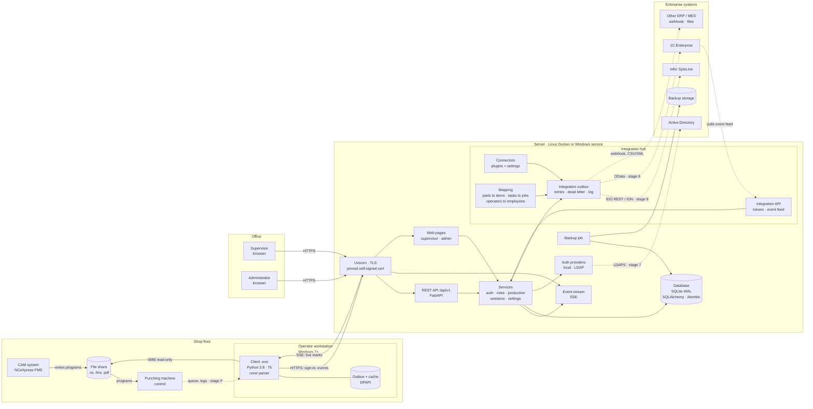
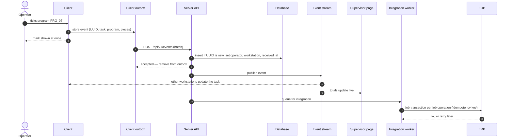

# Архитектура Nestrack

[English](ARCHITECTURE.md) · **Русский**

Nestrack вырос из [finnpower-counter](https://github.com/malinkin-s/finnpower-counter) — автономной утилиты,
сделанной под одну задачу на одном станке: показать оператору координатно-
пробивного станка Prima Power / Finn-Power (постпроцессор NCeXpress FMS),
какие позиции сменного задания закрыты. Nestrack развивает ту же идею
дальше: вход по ролям, журнал выработки, сессии, просмотр для мастера,
интеграция с каталогом и ERP. Всё это строится вокруг **сервера**, а на
рабочем месте оператора работает **клиент**.

finnpower-counter остаётся отдельным автономным проектом. Nestrack
использует его разбор файлов как зависимость.

Этот документ фиксирует решения и причины, по которым выбраны именно они.
Порядок внедрения — в [ROADMAP.ru.md](ROADMAP.ru.md), разбивка на задачи —
в [TASKS.md](TASKS.md) (на английском).

Состояние: **запланировано, не реализовано.**

---

## Общая картина

```
 Цеховой компьютер (Windows 7)            Сервер (Linux / Docker, либо Windows)
┌─────────────────────────────┐         ┌───────────────────────────────────┐
│ Клиент оператора (.exe)     │  HTTPS  │ API                               │
│  core/ — разбор .nc/.fms    │ ──────► │  вход, права, выработка, сессии   │
│  отметки, вход по PIN       │ ◄────── │ Поток событий (SSE)               │
│  очередь на отправку        │   SSE   │ База данных                       │
│  локальный кэш (DPAPI)      │         │ Веб-страницы мастера и админа     │
└─────────────────────────────┘         └───────────────────────────────────┘
                                                        ▲
                                  Браузер мастера ──────┘  HTTPS
                                  и администратора
```

| Кто | Чем пользуется | Что делает |
|---|---|---|
| Оператор | Клиент на цеховом компьютере | Открывает задание, отмечает программы, сохраняет сессии |
| Мастер | Веб-страница сервера в браузере | Смотрит выработку в реальном времени, выгружает CSV |
| Администратор | Веб-страница сервера | Пользователи, рабочие места, резервные копии |

Клиент остаётся только у оператора: ему нужен доступ к папке с `.nc` на
цеховом компьютере, а браузер его не даёт. Мастеру и администратору ничего
устанавливать не нужно.

Тестовые стенды — в [TEST_BENCH.md](TEST_BENCH.md) (на английском).

### Целевая система

Как система должна работать после всех этапов: узлы, конкретные решения на
каждом и связи между ними. Пунктиром — необязательное или поздние этапы.
Подписи на схемах — на английском, как и в основной версии документа.



### Одна отметка от начала до конца



Если сервер недоступен, шаги 4–11 ждут в очереди клиента; если недоступна
ERP, шаги 12–13 ждут в очереди интеграции. Ни то, ни другое не мешает
оператору.

---

## Почему сервер, а не общая сетевая папка

Первый вариант плана держал данные на общем сетевом диске без сервера:
журнал из зашифрованных файлов, ключи в файле, опрос папки. Он работал бы,
но почти вся его сложность — следствие отсутствия центрального узла:

| Задача | Сетевая папка | Сервер |
|---|---|---|
| Одновременная запись с нескольких машин | Журнал из файлов: SQLite на сетевом диске портится | Настоящая база с транзакциями |
| Изменения у других клиентов | Опрос папки раз в несколько секунд | Сервер сам присылает события сразу |
| Шифрование | Своё, на CNG через ctypes — главный риск на Win7 | TLS из стандартной библиотеки |
| Перебор PIN по копии файла ключей | Защита секретом рабочего места | Перебирать нечего: PIN проверяет сервер и ограничивает попытки |
| Права ролей | Только на стороне программы | Проверяет сервер |
| Выработка от чужого имени | Не защищено | Сервер сам ставит автора по сеансу входа |
| Расхождение часов на машинах | Идентификаторы событий, время ненадёжно | Время ставит сервер |

Цена: нужна машина под сервер и её обслуживание, две программы вместо
одной, договорённость между ними (API). Для цеха с несколькими рабочими
местами и мастером, которому нужны живые данные, это оправдано.

Сетевая папка остаётся **запасным путём**, если сервер окажется
невозможен: слой хранения в клиенте спрятан за интерфейсом, и второй
вариант можно подключить, не трогая окно и ядро.

---

## Что остаётся неизменным

- **Клиент — Windows 7 32-bit, Python 3.8.10, один `.exe`, без внешних
  зависимостей.** HTTPS и разбор JSON есть в стандартной библиотеке
  (`http.client`, `ssl`, `json`).
- **Файлы программ только читаются.** В `.nc`, `.fms` и карты наладки клиент
  не пишет, к стойке станка не обращается.
- **Разбор файлов берётся из finnpower-counter.** Его `core/` (и
  вспомогательный `presentation` на стандартной библиотеке) ставится как
  пакет фиксированной версии по тегу, и PyInstaller кладёт его в `.exe`
  клиента. Доработки разбора делаются там и доходят до обоих проектов.
- **Автономная работа остаётся за finnpower-counter.** Цеху без сервера
  нужен он; клиент Nestrack всегда работает с сервером и переживает обрывы
  связи благодаря работе без связи.

## Чем отличается от finnpower-counter

- **Клиенту нужна сеть.** Сборка finnpower-counter намеренно исключает
  `ssl`, `http`, `socket`, `email`, `urllib`; клиент Nestrack их включает.
- **Учёт ведётся** — на сервере, а не на цеховом компьютере.
  finnpower-counter истории не ведёт.
- Файлы программ по-прежнему не изменяются, станок не затрагивается.

---

## Сервер

### Платформа

Сервер не связан ограничениями цеховых компьютеров: современный Python,
обычные зависимости.

- **Основная платформа — Linux в Docker.** Одна команда поднимает сервер
  на виртуалке для тестов и в цеху. Эталонная поставка — `docker compose`.
- **Windows тоже поддерживается.** Код не использует ничего, что есть только
  в Linux, CI гоняет тесты сервера и на Windows. Запуск как службы Windows
  описывается отдельно, когда до него дойдёт.

### Технологии

| Что | Выбор | Почему |
|---|---|---|
| Веб-фреймворк | FastAPI + Uvicorn | Асинхронный, описание API генерируется само |
| База | SQLite в режиме WAL на локальном диске сервера | Нагрузки — десятки событий за смену; хватит с запасом, бэкап — копия файла |
| Слой доступа к базе | SQLAlchemy Core + Alembic | Миграции схемы; замена на PostgreSQL — смена строки подключения |
| Хеши паролей и PIN | `hashlib.scrypt` | В стандартной библиотеке, медленный по построению |
| Веб-страницы | Шаблоны Jinja2 + немного JavaScript | Без тяжёлого фронтенда: таблицы, фильтры, CSV |
| Живые обновления | Server-Sent Events | Обычный HTTP: браузер — `EventSource`, клиент — чтение потока через `http.client` |

**Почему SSE, а не WebSocket.** Поток нужен в одну сторону — от сервера к
клиентам; отметки клиент шлёт обычными запросами. SSE — это обычный HTTP-ответ,
который не заканчивается: его читает и браузер, и клиент на Python 3.8 без
сторонних библиотек. WebSocket в стандартной библиотеке нет.

**Кэширование.** Отдельный кэш на сервере (Redis и т. п.) не нужен: объёмы
малы, база отвечает быстрее, чем сеть до цеха. Кэш нужен на стороне
клиента — для работы без связи (см. ниже).

### Данные

| Таблица | Что хранит |
|---|---|
| `users` | Имя, роль, хеш PIN или пароля, признак блокировки |
| `workstations` | Зарегистрированные цеховые компьютеры и их ключи |
| `auth_sessions` | Сеансы входа: кто, с какого места, до какого времени |
| `tasks` | Сменные задания: идентификатор по содержимому, имена программ |
| `events` | Журнал выработки: отметки и снятия отметок |
| `bookmarks` | Сессии-закладки пользователей |
| `audit` | Вход, неудачные попытки, действия администратора |

Где лежит база и резервные копии, задаёт администратор в настройке сервера
(том Docker или папка на диске сервера).

### Шифрование

- **В пути — TLS.** Сервер работает только по HTTPS.
- **На диске сервера — средствами ОС**: шифрование диска виртуалки или
  тома (LUKS, BitLocker). Шифровать отдельные поля в базе смысла мало:
  сервер всё равно должен их расшифровывать, а управление ключами
  усложняется.
- **Сертификат.** В цеховой сети обычно нет своего удостоверяющего центра,
  поэтому сервер создаёт самоподписанный сертификат, а клиент при
  регистрации рабочего места запоминает его отпечаток и дальше доверяет
  только ему. Подменить сервер в сети не получится.

---

## Вход и рабочие места

- **Регистрация рабочего места.** Администратор в веб-панели создаёт
  рабочее место и получает одноразовый код. Код вводится в клиенте один раз;
  клиент получает ключ рабочего места и отпечаток сертификата и хранит их
  под защитой Windows (DPAPI).
- **Вход оператора — имя из списка и PIN.** Сервер принимает PIN только с
  зарегистрированного рабочего места и блокирует вход после нескольких
  неверных попыток. Украденный PIN без цехового компьютера бесполезен.
- **Вход мастера и администратора** — логин и пароль в браузере.
- **Роли проверяет сервер.** Клиент только прячет недоступное, но
  разрешение даёт сервер.

### Вход без связи

Если сервер недоступен при запуске, оператор может войти, если он уже
входил на этом компьютере: клиент хранит проверочное значение PIN,
полученное при последнем входе, под защитой DPAPI. Отметки, сделанные в
таком режиме, помечаются «вход без связи» и принимаются сервером после
восстановления связи — по ключу рабочего места.

---

## Выработка

### Событие

Отметка «программа выполнена» — событие:

| Поле | Кто ставит | Пример |
|---|---|---|
| `id` | клиент | UUID — для повторной отправки без дублей |
| `type` | клиент | `program_done` / `program_undone` |
| `task` | клиент | идентификатор задания (см. ниже) |
| `position`, `program` | клиент | 7, `PRG_07` |
| `sheets`, `pieces` | клиент | 5, `{"555001_zz2": 20}` |
| `occurred_at` | клиент | когда нажали, по часам компьютера |
| `operator`, `workstation` | **сервер** | по сеансу входа |
| `received_at` | **сервер** | по часам сервера |

Автора и время приёма ставит сервер: клиент не может записать выработку от
чужого имени. Повторная отправка события с тем же `id` ничего не меняет.

Снятая отметка — событие `program_undone`, а не удаление прежнего. Для
каждой программы задания действует последнее событие по порядку приёма
сервером.

### Идентификатор задания

Одно задание открывается с разных компьютеров по разным путям. Поэтому
идентификатор — хеш набора программ: имена `.nc` и их содержимое. Разбор
делает клиент тем же `core/`, серверу приходят готовые листы и штуки.

### Итоги и восстановление

- Итоги считаются из событий: по оператору, дню, смене, заданию; листы,
  программы, позиции, штуки. Исправление — новое событие, а не правка цифр.
- Сменщик открывает то же задание и видит отметки предыдущей смены —
  с любого рабочего места. Это закрывает исходную проблему пересменки.
- Мастер видит каждую отметку сразу: сервер рассылает событие всем
  подписанным клиентам и страницам.

---

## Сессии

Журнал — единственный источник правды об отметках. Сессия — **именованная
закладка** на сервере:

- пользователь вводит имя, к нему добавляются дата и время сохранения;
- сессия хранит автора, задание (идентификатор и путь) и отметки на момент
  сохранения;
- открыть сессию — открыть её задание с текущими отметками; отметки на
  момент сохранения показываются для сравнения.

---

## Клиент

### Асинхронность

Tk можно трогать только из главного потока, а сеть может отвечать секундами.

- **Весь обмен с сервером — в фоновом потоке** (`nestrack_client/worker.py`). Окно
  ставит задачу в очередь и получает результат через `root.after()`. Окно
  не зависает никогда.
- **Поток событий** держит отдельный фоновый поток: читает SSE и передаёт
  изменения окну. Обрыв — переподключение с паузой.
- **Состояние связи видно** в окне: «на связи», «нет связи, N отметок ждут
  отправки».

### Работа без связи

- Отметки пишутся в **локальную очередь на отправку** и досылаются, когда
  связь вернётся. Повторная отправка безопасна благодаря `id` события.
- **Локальный кэш** — последнее известное состояние заданий и список
  операторов для входа. Очередь и кэш зашифрованы DPAPI: скопировав файлы
  с цехового компьютера, их не прочитать на другом.
- Если два оператора без связи отметили одно и то же, действует порядок
  приёма сервером, а мастер видит такие отметки помеченными.

---

## Интеграции

Два вида, оба на сервере и оба настраивает администратор:

- **Каталог (этап 7).** Интерфейс поставщиков входа с реализациями `local`
  и `ldap`: мастер и администратор входят под учётными записями Active
  Directory, роли следуют доменным группам. Операторы у станка входят
  по имени и PIN.
- **Интеграционный модуль (этап 8).** ERP и другие системы подключаются
  через коннекторы-модули, настраиваемые в панели администратора: профили
  подключений, зашифрованные секреты, маршрутизация событий, таблицы
  сопоставления, очередь интеграции с повторами и журналом доставки, API
  интеграции для систем, которые предпочитают забирать данные сами
  (типично для 1С).

Подробности и исследование — [INTEGRATIONS.md](INTEGRATIONS.md) (на
английском).

---

## Договорённость клиента и сервера

- **API версионируется**: `/api/v1/...`. Цеховые клиенты обновляются не
  одновременно, поэтому сервер держит предыдущую версию API, пока ею
  пользуются.
- При подключении клиент сообщает свою версию, сервер — минимальную
  поддерживаемую. Слишком старый клиент получает понятное сообщение
  «обновите клиент», а не непонятную ошибку.
- Описание API генерируется сервером (OpenAPI) и лежит в репозитории —
  изменения в нём видны в PR.

---

## Структура репозитория

```
client/                   клиент оператора — Python 3.8, только стандартная библиотека
  nestrack_client/
    api.py                обращения к серверу (http.client + ssl)
    events.py             чтение потока SSE
    outbox.py             очередь на отправку
    cache.py              локальный кэш
    dpapi.py              защита локальных файлов средствами Windows
    worker.py             фоновый исполнитель
    settings.py           настройки рабочего места
    ui/                   окна: настройка, вход, оператор, сессии
  tests/
  client.spec             сборка PyInstaller
server/                   сервер — отдельный пакет со своими зависимостями
  nestrack_server/
    api/                  маршруты API
    web/                  страницы мастера и администратора
    db/                   схема, миграции
    services/             вход, права, выработка, сессии, выгрузка
  tests/
  Dockerfile
  docker-compose.yml
docs/
```

Разбора файлов в этом репозитории нет: клиент зависит от выпуска
finnpower-counter с тегом.

Клиент и сервер живут в одном репозитории: договорённость между ними
меняется в одном PR, и тесты проверяют обе стороны сразу.

---

## Риски

| Риск | Что с ним делать |
|---|---|
| Python 3.8 на Windows 7 не договорится с сервером по TLS | Проверка на реальной машине в самом начале, этап 0 |
| DPAPI через ctypes ведёт себя на Win7 не так | Там же, этап 0 |
| Сервер недоступен | Работа без связи, очередь на отправку; цеху без сервера — finnpower-counter |
| finnpower-counter и Nestrack расходятся | Nestrack фиксирует версию finnpower-counter по тегу; изменения разбора сначала проходят тесты finnpower-counter |
| Потеря базы на сервере | Резервные копии по расписанию, проверка восстановления |
| Разные версии клиентов в цеху | Версия API, минимальная поддерживаемая версия клиента |
| Кто обслуживает сервер | Поставка в Docker одной командой, инструкция для ИТ |
