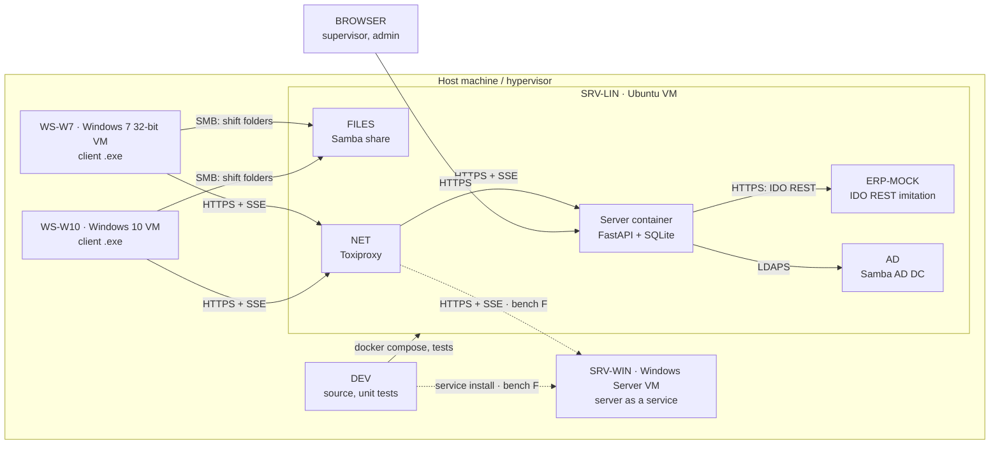

# Test benches

Which machines are needed to develop and test the system, what each one
runs and what it is for. Status: **planned, not built.**

Real shop-floor equipment is not available to an open-source project, so
every external system is represented by a node that can be set up on one
computer with virtual machines and containers.

---

## Nodes

| Node | Plays the role of | OS | Runs | Used for |
|---|---|---|---|---|
| **DEV** | Developer workstation | Any (Linux, Windows, macOS) | Source code, unit tests, the client from source, `docker compose` for the server | Everyday development |
| **SRV-LIN** | Production server | Ubuntu LTS VM | The server in Docker: API, web pages, SQLite volume, backups | Reference deployment; integration tests |
| **SRV-WIN** | Production server on Windows | Windows Server VM | The server as a Windows service | Checks that nothing is Linux-only (stage 6) |
| **WS-W7** | Shop-floor operator PC | Windows 7 SP1 32-bit VM | The client `.exe` built with PyInstaller; no Python installed | The real target: TLS, SSE, DPAPI, PIN sign-in, offline work |
| **WS-W10** | Newer shop-floor PC | Windows 10/11 VM | The same client `.exe` | Behaviour on current Windows |
| **FILES** | CAM output share | Samba container on SRV-LIN, or a Windows share | Shift folders with synthetic `.nc`, `.fms`, `.pdf` from finnpower-counter's `tools/make_fixtures.py` | Operators open tasks over the network, as on the floor |
| **AD** | Corporate domain controller | Samba AD DC container, or Windows Server AD DS VM | Test domain, users, groups `MES-Supervisors`, `MES-Admins` | LDAP sign-in and group → role mapping (stage 7) |
| **ERP-MOCK** | Infor SyteLine | Container on SRV-LIN | A small HTTP service imitating the IDO REST API: jobs, routings, items; records received job transactions | ERP connector development without a SyteLine licence (stage 8) |
| **NET** | Unreliable shop network | Toxiproxy container between clients and SRV-LIN | Latency, drops, bandwidth limits on demand | Offline mode, outbox, SSE reconnects |
| **BROWSER** | Supervisor's and admin's PC | Any | A current browser | Supervisor page, admin panel |
| **CI** | Automated bench | GitHub Actions: Ubuntu and Windows runners | Client and server tests, GUI smoke tests, server started as a service for integration tests | Every pull request |

Windows 7 is not available as a CI runner; WS-W7 checks are manual and
recorded in the pull request of each release candidate.

---

## Topology

---

## Bench configurations

Not every task needs every node.

| Bench | Nodes | For tasks |
|---|---|---|
| **A — Probe** | DEV, a throw-away probe server, WS-W7 | S0-01 |
| **B — Minimal** | DEV, SRV-LIN (server only), WS-W7, BROWSER | Stages 1–4 |
| **C — Network** | B + FILES + NET + WS-W10 | Stage 3 offline and concurrency tests; stage 5 |
| **D — Directory** | B + AD | Stage 7 |
| **E — ERP** | B + ERP-MOCK | Stage 8 |
| **F — Full** | All nodes, including SRV-WIN | Release candidates |

---

## Scenarios

Each scenario lists the bench and what "pass" means.

| # | Scenario | Bench | Pass when |
|---|---|---|---|
| T-01 | Probe: TLS with pinning, SSE, DPAPI on Windows 7 | A | All checks pass in the probe report |
| T-02 | First run: create admin, register WS-W7 with a one-time code | B | WS-W7 appears as active; the code cannot be reused |
| T-03 | Operator signs in with PIN, marks programs; supervisor page updates live | B | Marks appear on the page within seconds |
| T-04 | Two operators on WS-W7 and WS-W10 work on the same task | C | Both see each other's marks; totals are correct |
| T-05 | Network drop during a shift (NET cuts the link for 10 minutes) | C | Marks queue up, arrive exactly once after recovery; the window never freezes |
| T-06 | Server restart during a shift | C | Clients reconnect; no lost or duplicated events |
| T-07 | Offline sign-in with the server stopped | C | Only operators who signed in before on this PC can sign in |
| T-08 | Supervisor signs in with a domain account; role from group | D | Role matches the group mapping; removing the group removes access |
| T-09 | Completed programs become job transactions in the ERP | E | ERP-MOCK records one transaction per job operation, no duplicates on retry |
| T-10 | ERP unavailable for an hour | E | Production keeps being recorded; transactions are delivered afterwards |
| T-11 | Backup and restore of the server database | B | Restored server shows the same totals |
| T-12 | Mixed client versions against one server | F | Older client gets a clear update message; nothing is corrupted |

---

## Building the bench

- **Containers** (server, Samba, Samba AD, ERP mock, Toxiproxy) are described
  in a `bench/docker-compose.yml`, one command per bench configuration.
- **Windows VMs** are built by hand from a written checklist in
  `bench/windows.md`: OS version, updates, no Python, where the client
  `.exe` goes. Windows images cannot be shipped in an open-source repository.
- **Synthetic data only.** Shift folders come from finnpower-counter's `tools/make_fixtures.py`;
  no real plant data on any bench.

Tasks: TB-01…TB-06 in [TASKS.md](TASKS.md).
